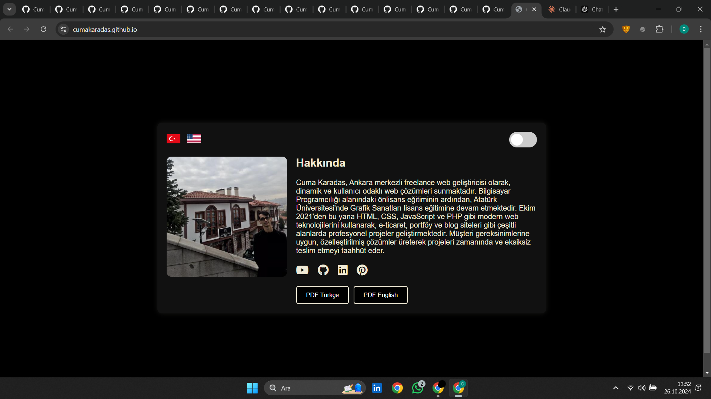
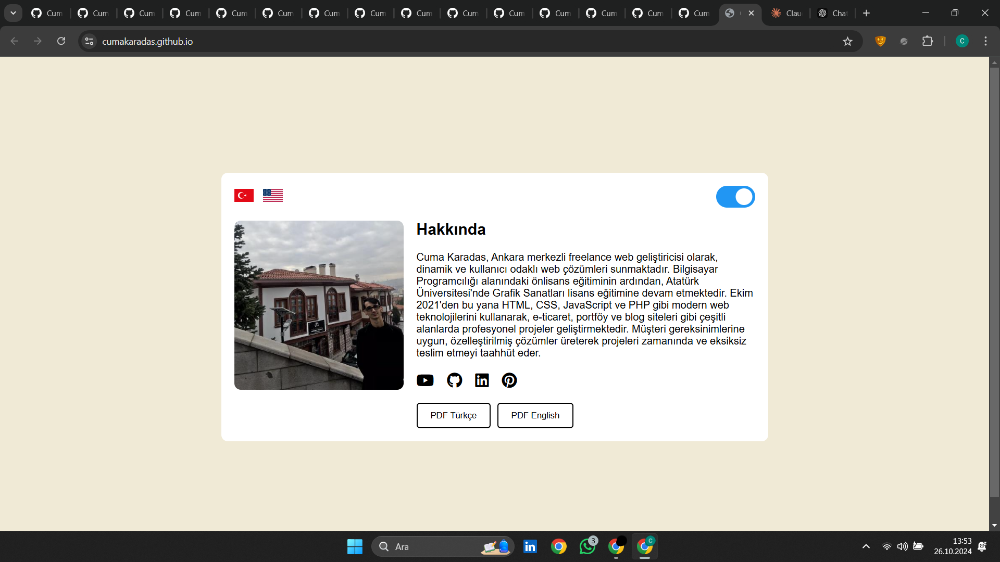

# Cuma Karadas - Portföy Sitesi

Bu proje, web geliştirici Cuma Karadas'ın yeteneklerini, projelerini ve bağlantılarını tanıtmak amacıyla oluşturulmuş bir portföy sitesidir. Site, iki dil seçeneği (Türkçe ve İngilizce) ve karanlık/aydınlık tema arasında geçiş yapma özellikleri sunarak kullanıcı deneyimini iyileştirmeyi hedeflemektedir.

## Özellikler

- **Çoklu Dil Desteği**: Türkçe ve İngilizce dil seçenekleri arasında geçiş yapılabilir.
- **Tema Geçişi**: Karanlık ve aydınlık mod arasında kolayca geçiş yapılabilir.
- **Sosyal Medya Bağlantıları**: YouTube, GitHub, LinkedIn ve Pinterest hesaplarına erişim sağlanır.
- **PDF İndirme**: Türkçe ve İngilizce özgeçmiş dosyalarını PDF olarak indirebilirsiniz.
- **Duyarlı Tasarım**: Masaüstü ve mobil cihazlarda uyumlu görüntüleme.

## Kurulum

Projeyi yerel ortamınızda çalıştırmak için aşağıdaki adımları takip edebilirsiniz:

1. Bu projeyi bilgisayarınıza klonlayın:
   ```bash
   git clone https://github.com/kullaniciadiniz/proje-adi.git
   ```

2. Proje dizinine gidin:
   ```bash
   cd proje-adi
   ```

3. Gerekli bağımlılıkları yükleyin (varsa).
4. `index.html` dosyasını bir tarayıcıda açarak projeyi görüntüleyin.

## Kullanılan Teknolojiler

- **HTML5**: Sayfa yapısını oluşturmak için kullanıldı.
- **CSS3**: Sayfa düzeni ve tasarımı için kullanıldı.
- **JavaScript**: Tema ve dil geçişleri gibi etkileşimli özellikleri sağlamak için kullanıldı.
- **Font Awesome**: Sosyal medya ikonları için kullanıldı.
- **Google Fonts**: Yazı tipleri için kullanıldı.

## Dosya Yapısı

```
├── index.html          # Ana HTML dosyası
├── style.css           # CSS dosyası (varsa)
├── script.js           # JavaScript dosyası (varsa)
├── assets/            # Resimler ve diğer medya dosyaları
└── README.md          # Proje hakkında bilgiler
```

## Ekran Görüntüleri

**Karanlık Mod:**


**Aydınlık Mod:**


## Katkıda Bulunma

Bu projeye katkıda bulunmak isterseniz lütfen bir `fork` oluşturun ve değişikliklerinizi `pull request` ile gönderin. Her türlü katkı, hataların düzeltilmesi ve öneriler memnuniyetle karşılanır.

## Lisans

Bu proje MIT Lisansı ile lisanslanmıştır. Daha fazla bilgi için `LICENSE` dosyasına bakın.

## İletişim

Cuma Karadas ile iletişime geçmek için aşağıdaki sosyal medya hesaplarını kullanabilirsiniz:

- [YouTube](https://www.youtube.com/@CumaKaradash)
- [GitHub](https://github.com/CumaKaradash)
- [LinkedIn](https://www.linkedin.com/in/cuma-karada%C5%9F-0a5092261/)
- [Pinterest](https://tr.pinterest.com/PogacaSevenOrdek/)

---

Bu portföy sitesi, Cuma Karadas'ın projelerini ve yeteneklerini tanıtmak amacıyla yapılmıştır. İlginiz için teşekkürler!
